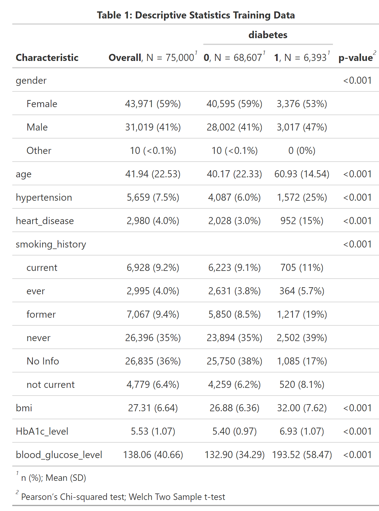
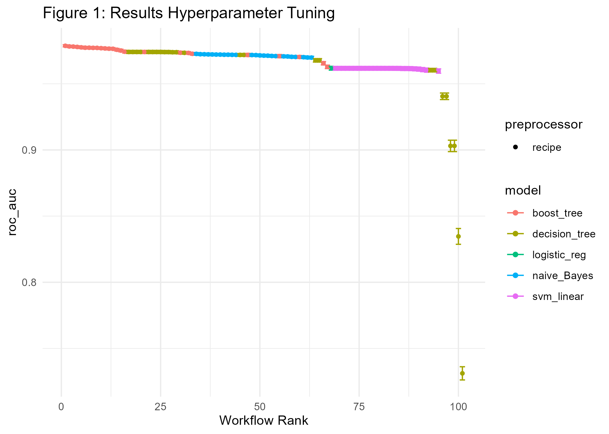
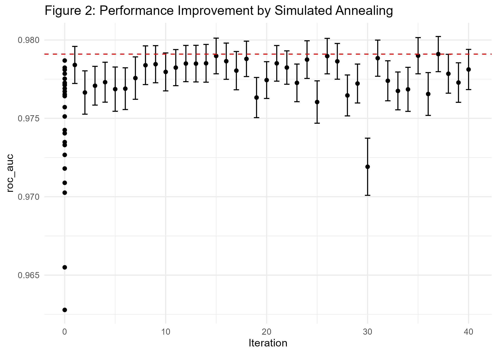
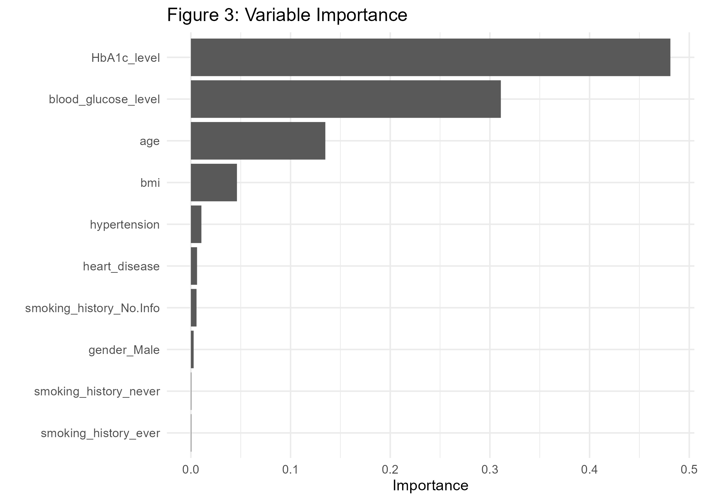
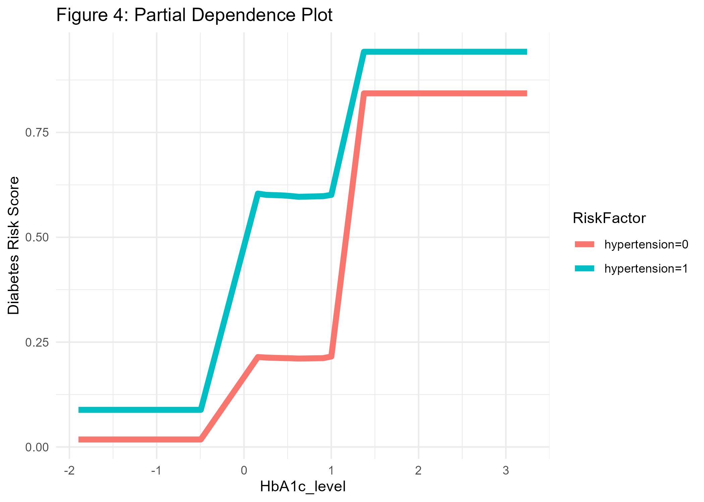
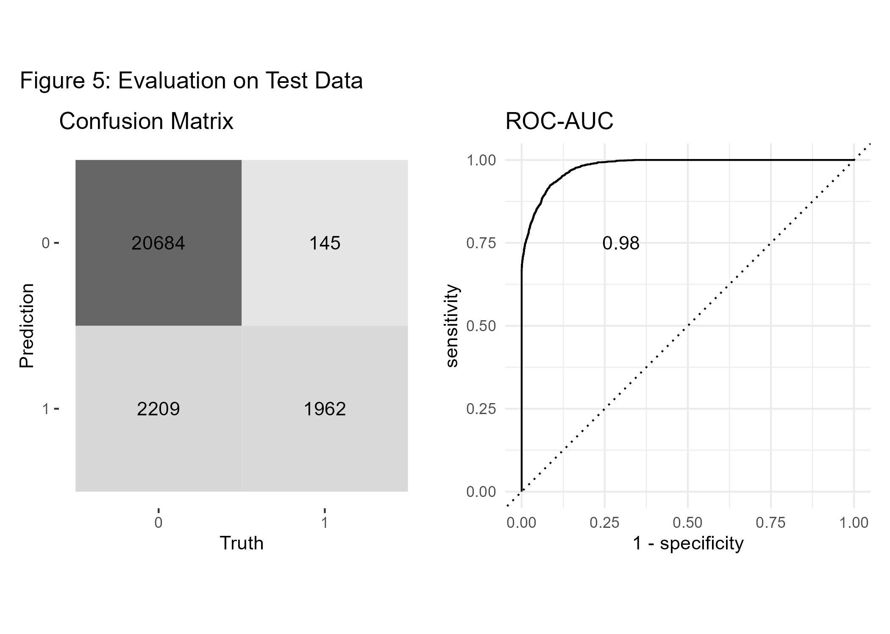

```{r setup, include=TRUE, message=FALSE, warning=FALSE, cache=FALSE} 

#Preliminaries:
knitr::opts_chunk$set(message=FALSE, warning=FALSE, eval = FALSE) #set eval = TRUE when run first

rm(list=ls())

library(tidyverse)
library(tidymodels)
library(themis)
library(doParallel)
library(gtsummary) 
library(gt)
library(bonsai) 
library(discrim)
library(finetune)
library(patchwork)
library(vip)
library(DALEXtra) 

dir.create("cl_diabetes", showWarnings = FALSE)

tidymodels_prefer() 

```


## Motivation

Diabetes is a leading cause of death and disability worldwide, affecting people regardless of country, age, and sex. Type 2 diabetes, which makes up most of the diabetes cases, is largely preventable and sometimes potentially reversible if identified and managed early in the disease course. [@ong2023global] Hence, diagnostic routines play an important role in diabetes healthcare management. In order to be able to reliably predict the disease we first need to learn the association between risk factors and diabetes from data, and secondly, we need to provide out-of-sample predictions using new patient data.
But how can we learn about the association between available features (risk factors) and diabetes? We use the <a href="https://www.tidymodels.org/" target="_blank"> tidymodels framework </a> and apply different machine learning methods to the <a href="https://www.kaggle.com/datasets/iammustafatz/diabetes-prediction-dataset" target="_blank"> Kaggle diabetes data set. </a>

## Data & Modeling Strategy

The data contains 100.000 instances, the binary label *diabetes*, and 8 potential risk factors. We split the data into training and test partitions (75/25) before further analysis.

```{r label='diab_chk1'}

#download data from Kaggle and include into folder cl_diabetes
#read the data:
diabetes_df <- read_csv('cl_diabetes/diabetes_prediction_dataset.csv') %>%
  mutate(diabetes = as.factor(diabetes)) %>%
  mutate(bmi=as.numeric(case_when(bmi!='N/A' ~ bmi,
                                  TRUE ~ NA_real_))) %>%
  mutate_if(is.character, as.factor) 


# Reproducibility 
set.seed(1005)

# Divide data into training and test: 
diabetes_split <- diabetes_df %>%
                initial_split(prop = 0.75, strata=diabetes)

diabetes_train_df <- training(diabetes_split)
diabetes_test_df  <-  testing(diabetes_split)


#create summary statistics:
hd_tab1 <- diabetes_train_df %>% 
  tbl_summary(by=diabetes,
              statistic = list(all_continuous() ~ "{mean} ({sd})",
                              all_categorical() ~ "{n} ({p}%)"),
              digits = all_continuous() ~ 2) %>%
    add_p(test=list(all_continuous() ~ "t.test", 
                    all_categorical() ~ "chisq.test.no.correct")) %>%
  add_overall() %>%
  modify_spanning_header(c("stat_1", "stat_2") ~ "**diabetes**") %>%
  modify_caption("**Table 1: Descriptive Statistics Training Data**") 

#save summary statistics:
hd_tab1 %>%
  as_gt() %>%
  gtsave("cl_diabetes/diabetes_tab1.png", expand = 10)

```

<center>

{width=50%} 

</center>

A first look at the dataset shows that all explanatory variables are associated with diabetes, as the p-values < 0.001 suggest. As expected aging and morbidities hypertension and heart disease are positively correlated with diabetes. We also see that our outcome of interest - diabetes - is very unbalanced, which we should keep in mind when selecting our evaluation metric. The <a href="http://www.feat.engineering/" target="_blank"> feature engineering </a>-steps are pretty straightforward. After having created the training and test partitions we normalize all numeric predictors and create dummy variables for the categorical ones. Furthermore, we down-sample the data toward the minority class.

```{r label='diab_chk2'}

# data preparation before training:
diabetes_recipe <-
  recipe(diabetes ~ ., data=diabetes_train_df) %>%
  step_normalize(all_numeric_predictors()) %>%
  step_dummy(all_nominal_predictors()) %>%
  step_zv(all_predictors()) %>%
  step_downsample(diabetes) 

```

We compare different model types in our analysis because we want to select the model which predicts diabetes best. As @domingos2012few points out, the best model depends on the use case and cannot be known in advance. Henceforth, we use XGBoost, naive Bayes, a support vector machine, a decision tree model, and logistic regression in our workflow. On the one hand, we consider logistic regression as our baseline model because it is simple and needs no additional hyperparameter tuning. On the other hand, simple decision trees have the advantage that they a highly interpretable and are therefore part of the human decision-making toolkit [eg. @wang2022modeling].

```{r label='diab_chk3'}

# try out different ml-approaches: 
lr_mod <- logistic_reg() %>%
  set_engine("glm") %>% 
  set_mode("classification")

svm_mod <- svm_linear(cost = tune(), margin = tune()) %>% 
  set_engine("kernlab") %>% 
  set_mode("classification")

xgb_mod <- boost_tree(tree_depth = tune(), learn_rate = tune(), loss_reduction = tune(), 
             min_n = tune(), sample_size = tune(), trees = tune()) %>% 
  set_engine("xgboost") %>% 
  set_mode("classification")

nb_mod <- naive_Bayes(smoothness = tune(), Laplace = tune()) %>% 
  set_engine("naivebayes") %>% 
  set_mode("classification")

cit_mod <- decision_tree(tree_depth=tune(), min_n=tune()) %>%
  set_engine(engine = "partykit") %>%
  set_mode(mode = "classification") 


```

## Hyperparameter Tuning

To manage the <a href="https://www.bradyneal.com/bias-variance-tradeoff-textbooks-update" target="_blank"> bias-variance tradeoff </a> the model's hyperparameters are selected by combining cross-validation using a space-filling grid search design. We consider ROC-AUC as our evaluation metric of interest. The AUC is threshold-independent and therefore often a good choice in situations when the outcome variable is relatively unbalanced. [See for example @fawcett2006introduction]. Finally, parallelization helps speed up the whole process. 

```{r label='diab_chk4'}

# prepare cross validation 
set.seed(1001)
diabetes_train_folds <- vfold_cv(diabetes_train_df, v=8, strata = diabetes)

# prepare workflow
wf_set <- workflow_set(
    preproc = list(mod = diabetes_recipe), 
    models = list(log_reg=lr_mod, svm_linear = svm_mod, xgboost=xgb_mod, naiveBayes=nb_mod, tree=cit_mod)) 

# prepare grid: 
grid_ctrl <-
  control_grid(
    save_pred = TRUE,
    parallel_over = "everything",
    save_workflow = TRUE , 
    event_level = "second"
  )


# prepare parallel processing: 
cores <- parallel::detectCores(logical = TRUE)


# Create a cluster object and then register: 
cl <- makePSOCKcluster(cores) 
registerDoParallel(cl)

# Start hyperparameter tuning:
train_results <- wf_set %>%
  workflow_map(
    fn = 'tune_grid', 
    metrics = metric_set(roc_auc), 
    seed = 1503,
    resamples = diabetes_train_folds, 
    grid = 25, 
    control = grid_ctrl 
  )

stopCluster(cl)

#plot results of hyperparameter tuning:
p1_diab <- train_results %>%
  autoplot() +
  theme_minimal() +
  labs(title='Figure 1: Results Hyperparameter Tuning')

ggsave(p1_diab, file="cl_diabetes/p1_diab.png")


```

<center>

{width=60%}
</center>

Figure 1 shows performance metrics for all experiments ranked by AUC. We find that XGBoost gives the best results concerning AUC followed by the decision tree, naive Bayes, and logistic regression. 

## Further Optimization

Can we still improve on the current result? Although we considered a space-filling grid search design when tuning hyperparameters, there may be room for further improvement. Hence, we apply <a href="https://www.tmwr.org/iterative-search.html" target="_blank"> simulated annealing, </a> iteratively trying out little hyperparameter changes, starting from the current best model. 

```{r label='diab_chk5'}

xgb_results <- train_results %>% 
            extract_workflow_set_result("mod_xgboost") 

xgb_wf <- train_results %>% 
  extract_workflow("mod_xgboost")


cl <- makePSOCKcluster(cores) 
registerDoParallel(cl)

#Increase performance with simulated annealing

set.seed(1005)
xgb_sa <- xgb_wf %>%
    tune_sim_anneal(
    resamples =diabetes_train_folds,
    metrics = metric_set(roc_auc), 
    initial = xgb_results,
    iter = 40, 
    control = control_sim_anneal(verbose = TRUE, 
                                 no_improve = 10L, event_level = "second", cooling_coef = 0.1))

stopCluster(cl)

# save max auc:
auc_out <- xgb_sa  %>% 
  collect_metrics() %>% 
  slice_max(mean) %>%
  pull(mean)


# visualize sim annealing:
p2_diab <- autoplot(xgb_sa, type = "performance", metric = 'roc_auc') +
  geom_hline(yintercept=auc_out, linetype="dashed", color = 'red') +
  labs(title='Figure 2: Performance Improvement by Simulated Annealing ') +
  theme_minimal()

ggsave(p2_diab, file="cl_diabetes/p2_diab.png")

```

<center>

{width=60%}
</center>

The results in Figure 2 show that we only did achieve minimal improvements compared to the current best model (AUC of 0.978).

## Interpretable Machine Learning

One important aspect of ML classifiers is that models with high predictive power do not necessarily have good explanatory power [eg. @shmueli2010explain]. In order to generate actionable insights it may nevertheless be very helpful to understand how the classifier comes to a certain conclusion. This is especially important in the medical field. Hence, <a href="https://christophm.github.io/interpretable-ml-book/" target="_blank"> interpretable machine learning </a> can be an important driver for building trust in data-driven technologies. For example, the variable importance plot in Figure 3 shows that the variables HbA1c-level, blood glucose, age, and BMI are major factors that contribute to the diabetes-model fit.


```{r label='diab_chk6'}
# extract model fit after simulated annealing: 
xgb_fit <- xgb_sa %>% 
  extract_workflow() %>%
  finalize_workflow(xgb_sa %>% select_best())  %>%
  fit(data = diabetes_train_df) %>%
  extract_fit_parsnip()

# Variable importance plot:
p3_diab <- xgb_fit %>%
  vip() +
  theme_minimal() +
  labs(title="Figure 3: Variable Importance")

ggsave(p3_diab, file="cl_diabetes/p3_diab.png")

```

<center>

{width=60%}
</center>

A look at partial dependence plots reveals the conditional impact of our explanatory variables on the predictions: 

```{r label='diab_chk7'}

#prepare training data for pdp:
xgb_df <- xgb_sa %>% 
  extract_workflow() %>%
  finalize_workflow(xgb_sa %>% select_best())  %>%
  fit(data = diabetes_train_df) %>%
  extract_recipe() %>%
  bake(new_data=diabetes_train_df)

explain_xgb <- explain_tidymodels(
                model=xgb_fit, 
                data = (xgb_df %>% dplyr::select(-diabetes)), #data without target column
                y = xgb_df$diabetes,
                label = "xgboost",
                verbose = FALSE
              )

# create model profile:
pdp_diab  <- model_profile(explain_xgb, N=1000, variables = "HbA1c_level", groups='hypertension') 

#Create ggplot manually for HbA1c, grouped by hypertension:
p4_diab <- pdp_diab$agr_profiles %>% 
  as_tibble() %>%
  mutate(RiskFactor=paste0('hypertension=', ifelse(stringr::str_sub(`_label_`, 9, 9)=='-', '0', '1'))) %>%
  ggplot(aes(x=`_x_`, y=`_yhat_`, color=RiskFactor)) +
  geom_line(linewidth=2) +
  labs(y='Diabetes Risk Score', x='HbA1c_level', title='Figure 4: Partial Dependence Plot') +
  theme_minimal() 

ggsave(p4_diab, file="cl_diabetes/p4_diab.png")

```

<center>

{width=60%}
</center>

For example, in Figure 4 we see that the conditional association between HbA1c level and diabetes is positive, and even more pronounced for people with hypertension, which makes sense as hypertension is another known risk factor for diabetes. At this point, we should also remember that our predictions cannot be interpreted as probabilities [@van2019calibration]. If we would like the predicted values to equal expected probabilities we would need to <a href="https://www.unofficialgoogledatascience.com/2021/04/why-model-calibration-matters-and-how.html" target="_blank"> recalibrate </a> the risk scores or use another modeling strategy.

## Testing

Now, as we have developed a final model, we will test whether our predictions do also perform well on new unseen data. Hence we will test the model performance on our hold-out data partition. As usual, the confusion matrix is based on a risk-score cutoff of 0.5. The AUC of 0.98 on the test data confirms that the model generalizes well on unseen data. 


```{r label='diab_chk8'}

# Fit new best model once on test data at the final end of the process: 
test_results <- xgb_sa %>%
  extract_workflow() %>%
  finalize_workflow(xgb_sa %>% select_best()) %>% 
  last_fit(split = diabetes_split)

# create predictions:
test_p <- collect_predictions(test_results)

# confusion matrix:
conf_mat <- conf_mat(test_p, diabetes, .pred_class) 

p5a_diab <- conf_mat %>%
  autoplot(type = "heatmap") +
  theme(legend.position = "none") +
  labs(title='Confusion Matrix')

#AUC overall
auc <- test_p %>%
  roc_auc(diabetes, .pred_1, event_level = "second") %>%
  mutate(.estimate=round(.estimate, 3)) %>%
  pull(.estimate)

#ROC-curve
roc_curve <- roc_curve(test_p, diabetes, .pred_1, event_level = "second") 

p5b_diab <- roc_curve %>%
  autoplot() +
  annotate('text', x = 0.3, y = 0.75, label = auc) +
  theme_minimal() +
  labs(title='ROC-AUC')
  
#combine both plots:
p5_diab <- p5a_diab + p5b_diab + plot_annotation('Figure 5: Evaluation on Test Data')

ggsave(p5_diab, file="cl_diabetes/p5_diab.png")

```

<center>

{width=60%}
</center>

## Conclusion

We did a comparative analysis of different machine learning classifiers to predict diabetes with some medical risk factors using the tidymodels framework. Then we showed how to further improve the best model (in our case XGBoost) using iterative grid search before validating the model on test data. In addition, we applied visualization methods to better understand how the predictions are generated. Overall, we see that machine learning methods can fruitfully support medical decision-making, if the model is well developed, validated, and <a href="https://vetiver.rstudio.com/" target="_blank"> integrated carefully </a> into the application of interest. 

---
nocite: |
 @dalex, @tidymodels, @kuhn2022tidy
---

## References